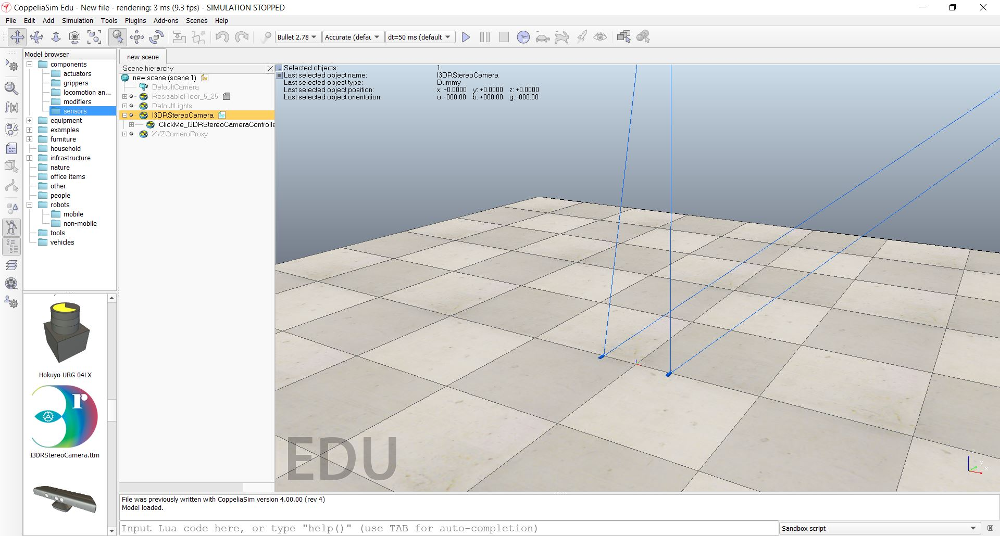
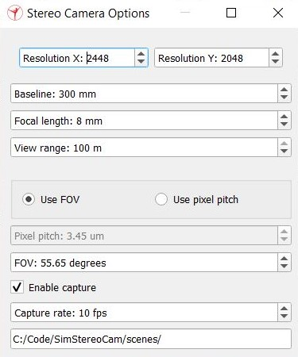

# Sim Stereo Cam
Simulation of a Stereo Camera. 

This repository holds the following tools for simulation of a stereo camera:
 - Stereo camera CoppeliaSim model with adjustable parameters
 - Python script for using the images generated from the simulation to create disparity maps and point clouds
 - OpenSCAD scripts for generating 3D models of the camera views and overlap

## Required
 - **CoppeliaSim** (tested on v4.0.0) [download](https://www.coppeliarobotics.com/downloads)
 - **Python** (tested on v3.7) [download](https://www.python.org/downloads/release/python-378/)
    - **Stereo3D** python package available as a pip install (python -m pip install stereo3d)
 - **OpenSCAD** (tested on v2019.05) [download](https://www.openscad.org/downloads.html)

## Demo
A demo scene is provided in this repository in 'scenes/demo1'.
This has a CoppeliaSim scene with a selection of objects and the I3DRStereoCamera model. 

Also provided in this demo folder are the camera overlap stl's that were created using the openSCAD scripts (also included). These were placed in the CoppeliaSim scene and can be seen as pale blue and red objects. 

The 3D generation script with the parameters set to match the simulated model is also provided in this folder for quick running of the demo. 
To test this, run the simulation, wait for the stereo camera to take a couple of images. Then run the gen3d.py python script and wait for it to generate disparity maps and point clouds for each image pair. 

## Load Model
The stereo camera model (I3DRStereoCamera.ttm) can be found in the 'models' folder of this repository.
To load this model into a CoppeliaSim scene click File->Load model.

Alternatively copy the stereo camera model file into CoppeliaSim's model directory:  
*C:\Program Files\CoppeliaRobotics\CoppeliaSimEdu\models\components\sensors*  
Then restart CoppeliaSim and load the model from the Model browser.



Click and drag I3DRStereoCamera from the model browser onto the scene or scene hierarchy.  
*CoppeliaSim must be restarted after copying the model file into the model directory for it to show up.*

## Graphical User Interface
Once loaded into a CoppeliaSim scene the camera parameters can be adjusted with a GUI interface.
This is opened by clicking on the 'ClickMe_I3DRStereoCameraController', which is a child object of the I3DRStereoCamera.



This will hide itself when the simulation starts. 

## Camera Parameters
### Resolution
The pixel resolution of the camera in x and y. Due to the way it handels cameras CoppeliaSim recommends a power of 2 (e.g. 2,4,8,16...), however, this is not required.

**Default: 2448 x 2048**  
**Maximum: 10000 x 10000**  
**Minumum: 1 x 1**

### Baseline
The distance between left and right camera in millimeters. This will change the overlap of the cameras FOV.

**Default: 300mm**  
**Maximum: 10000mm**  
**Minumum: 1mm**

### Focal Length
The focal length of the camera in millimeters. This will be the same for both cameras. 

**Default: 8mm**  
**Maximum: 50mm**  
**Minimum: 1mm**  

### View Range
This maximum view range of the camera. This is a hard limit to the distance the camera can 'see'. Usually this can be set to the maximum (100m).

**Default: 100m**  
**Maximum: 100m**  
**Minimum: 1m**  

### Use FOV / Use Pixel Pitch
This allows for switching between using field of view (FOV) or pixel pitch when defining the camera parameters. When using FOV pixel pitch is automaically calculated and visa versa. 
Simulated vision sensors in CoppeliaSim use the perspective angle model which requires the FOV so this the actualy value that is actually used. See 'Equations' section for details on the equations used here. 

**Default: Use FOV**  

### Pixel Pitch
This is the distance in millimeters from the center of a pixel to the center of the adjacent pixel. This is a measure of the pixel density. All camera datasheets should provide this information. When is FOV mode this is automatically calculated from the FOV. See 'Equations' section for details on the equations used here. 

**Default: 3.45um**  
**Maximum: 100um**  
**Minimum: 0.01um**  

### FOV
Field of view (FOV) of the camera in degrees. When in pixel pitch mode this is automatically calculated from the pixel pitch. See 'Equations' section for details on the equations used here. 

**Default: 55.65 degrees**  
**Maximum: 180 degrees**  
**Minimum: 1 degrees**  

### Enable Capture
Enable/disable capturing of images from the simualted cameras to be saved to file. If enabled the capture rate and image folder path is used. Otherwise these options are disabled.

**Default: Enabled**  

### Capture Rate
The simulated frame rate of the cameras. This is the rate at which the images are saved to the image folder.

**Default: 10fps**  
**Maximum: 100fps**  
**Minimum: 1fps**  

### Image folder
This is the folder where the captured images from the stereo cameras are saved. 

**Default: Path to current CoppeliaSim scene**  

## Image Capture
When the simuation is started images will be captured from the left and right cameras and saved to the folder specified in the Stereo Camera Options GUI. This will only happen if the 'Enable capture' tick box was ticked in the GUI (enabled by default). 

This will save a left and right image to the folder with the following naming scheme:  
%time%_l.png  
%time%_r.png 

## Generating 3D
Provided in this repository is a python script for generating disparity maps and point clouds from image files. This can be found in the 'scripts' folder named 'gen3d.py'. 
Place this script in the folder where the simulated stereo camera images were saved and adjust the camera parameters to your specific camera setup. Alternatively change the 'folder' variable to the folder where the simualted stereo camera images were saved. 
```
folder = "path/to/images/"
```
3D is generated in this script using the Stereo3D package from I3D Robotics ([here](https://pypi.org/project/Stereo3D/)).
To use this script install the stereo3d package with a pip install.
```
python -m pip install stereo3d
```

### Camera parameters
The camera parameters used in this script are the same as the parameters from the Stereo Camera Options GUI, however, all are in SI units. (E.g. meters)  
Adjust the following to your camera specifics:
```
resolution = [2448,2048] # pixels
pixel_pitch=0.00000345 # meters
focal_length=0.008 # meters
baseline=0.3 # meters
```
This script can be used in two modes; changes only mode, and all files mode. To set these modes change the 'load_mode' variable to 'LOAD_MODE_CHANGES_ONLY' or 'LOAD_MODE_ALL'.

### Changes only mode
In changes only mode only the files that have been added since the script was started will be loaded into the stereo generator. This can be used as a pseudo live 3D result. 

### All file mode
In all file mode, all the files in the chosen folder are loaded into the stereo generator.

### Stereo matcher
Stereo3D uses OpenCV stereo matchers to generate disparity from the left and right image.   

'stmatcher' is the varaible loaded into the Stereo3D class which defines the matcher to use.
Uncomment out the matcher to use and comment out the other.
```
#stmatcher = cv2.StereoBM_create() # faster / less accurate
stmatcher = cv2.StereoSGBM_create() # slower / more accurate
```
The stereo matcher parameters can be adjusted by changing the following variables:
```
min_disp = 1037
num_disparities = 30
block_size = 5
uniqueness_ratio = 15
speckle_size = 30
speckle_range = 1000
```

### Preview GUI
Stereo3D GUI can be displayed to preview the disparity result before saving. This can be enable by setting the 'showPreviewGUI' varaible to True. (False by default).
```
showPreviewGUI = True
```

### Running the script
To get the best 3D results it is advised to run the script with 'showPreviewGUI' set to 'True' and testing out one image adjusting the sliders to get the desired disparity output. Make a note of the parameters chosen, stop the script, and hard code the parameters used. Before re-running the script with 'showPreviewGui' set to 'False'. 

## Equations
When using FOV the pixel pitch is caluculated using the following formula:


When using pixel pitch the FOV is caluculated using the following formula:


where   
pp = Pixel pitch (m)  
f = Focal length (m)  
FOV<sub>x</sub> = Field of view in X (radians)  
r<sub>x</sub> = Resolution in X (pixels)

These are derived in the following way.

Pixel pitch (pp) is calculated from the detector size (d<sub>x</sub>), divided by the resolution (r<sub>x</sub>).


FOV (FOV<sub>x</sub>) can be calulated given the focal length (f) and detector size (d<sub>x</sub>).


Rearranging the pixel pitch equation for detector size (d<sub>x</sub>) and replacing detector size (d<sub>x</sub>) in the FOV equation allows calculating of the FOV (FOV<sub>x</sub>) from pixel pitch (pp), resolution (r<sub>x</sub>), and focal length (f).


This can then be rearranged for pixel pitch (pp) to find the equation that allows calculating of the pixel pitch (pp) from FOV(FOVx), resolution (r<sub>x</sub>), and focal length (f).


