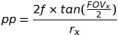
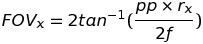
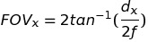

# Sim Stereo Cam
Simulation of a Stereo Camera in CoppeliaSim. 

This repository holds a stereo camera CoppeliaSim model with adjustable parameters

## Load Model
The stereo camera model (I3DRStereoCamera.ttm) can be found in the 'models' folder of this repository.
To load this model into a CoppeliaSim scene click File->Load model.

## Graphical User Interface
Once loaded into a CoppeliaSim scene the camera parameters can be adjusted with a GUI interface.
This is opened by clicking on the 'ClickMe_I3DRStereoCameraController', which is a child object of the I3DRStereoCamera.

## Camera Parameters
### Resolution
The pixel resolution of the camera in x and y. Due to the way it handels cameras CoppeliaSim recommends a power of 2 (e.g. 2,4,8,16...), however, this is not required.

**Default: 2448 x 2048**  
**Maximum: 10000 x 10000**  
**Minumum: 1 x 1**

### Baseline
The distance between left and right camera in millimeters. This will change the overlap of the cameras FOV.

**Default: 300mm**  
**Maximum: 10000mm**  
**Minumum: 1mm**

### Focal Length
The focal length of the camera in millimeters. This will be the same for both cameras. 

**Default: 8mm**  
**Maximum: 50mm**  
**Minimum: 1mm**  

### View Range
This maximum view range of the camera. This is a hard limit to the distance the camera can 'see'. Usually this can be set to the maximum (100m).

**Default: 100m**  
**Maximum: 100m**  
**Minimum: 1m**  

### Use FOV / Use Pixel Pitch
This allows for switching between using field of view (FOV) or pixel pitch when defining the camera parameters. When using FOV pixel pitch is automaically calculated and visa versa. 
Simulated vision sensors in CoppeliaSim use the perspective angle model which requires the FOV so this the actualy value that is actually used. See 'Equations' section for details on the equations used here. 

**Default: Use FOV**  

### Pixel Pitch
This is the distance in millimeters from the center of a pixel to the center of the adjacent pixel. This is a measure of the pixel density. All camera datasheets should provide this information. When is FOV mode this is automatically calculated from the FOV. See 'Equations' section for details on the equations used here. 

**Default: 3.45um**  
**Maximum: 100um**  
**Minimum: 0.01um**  

### FOV
Field of view (FOV) of the camera in degrees. When in pixel pitch mode this is automatically calculated from the pixel pitch. See 'Equations' section for details on the equations used here. 

**Default: 55.65 degrees**  
**Maximum: 180 degrees**  
**Minimum: 1 degrees**  

### Enable Capture
Enable/disable capturing of images from the simualted cameras to be saved to file. If enabled the capture rate and image folder path is used. Otherwise these options are disabled.

**Default: Enabled**  

### Capture Rate
The simulated frame rate of the cameras. This is the rate at which the images are saved to the image folder.

**Default: 10fps**  
**Maximum: 100fps**  
**Minimum: 1fps**  

### Image folder
This is the folder where the captured images from the stereo cameras are saved. 

**Default: Path to current CoppeliaSim scene**  

## Equations
When using FOV the pixel pitch is caluculated using the following formula:

When using pixel pitch the FOV is caluculated using the following formula:

where   
pp = Pixel pitch (m)  
f = Focal length (m)  
FOVx = Field of view in X (radians)  
rx = Resolution in X (pixels)

These are derived in the following way.

Pixel pitch (pp) is calculated from the detector size (dx), divided by the resolution (rx).

FOV (FOVx) can be calulated given the focal length (f) and detector size (dx).

Rearranging the pixel pitch equation for detector size (dx) and replacing detector size (dx) in the FOV equation allows calculating of the FOV (FOVx) from pixel pitch (pp), resolution (rx), and focal length (f).

This can then be rearranged for pixel pitch (pp) to find the equation that allows calculating of the pixel pitch (pp) from FOV(FOVx), resolution (rx), and focal length (f).

